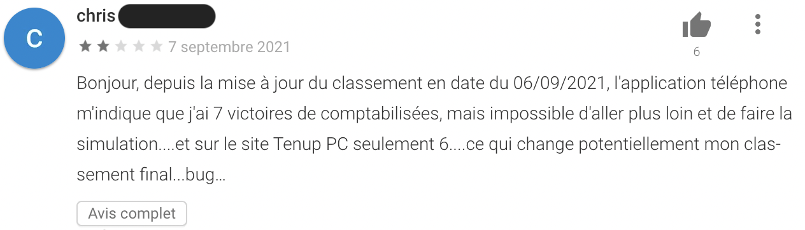
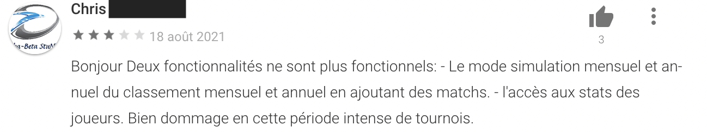
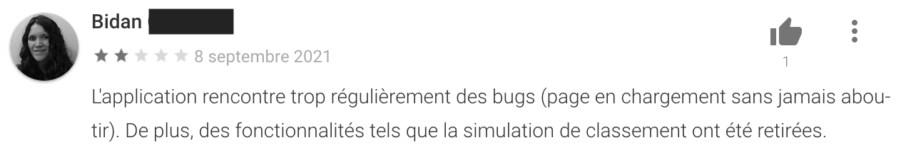
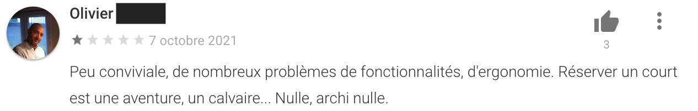
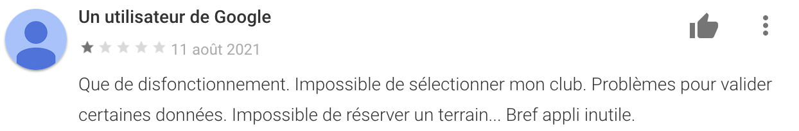
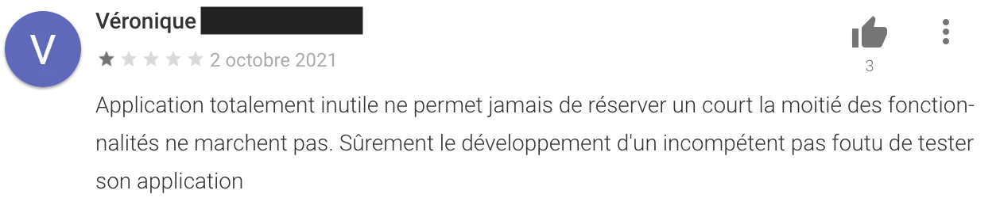
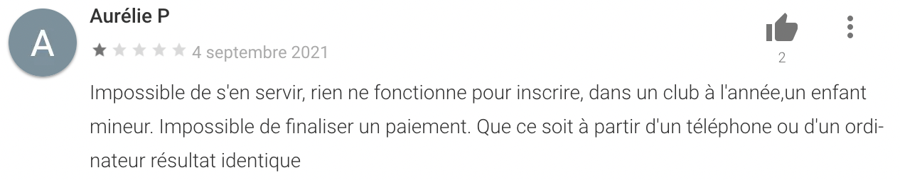
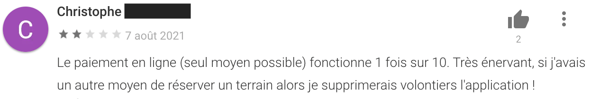
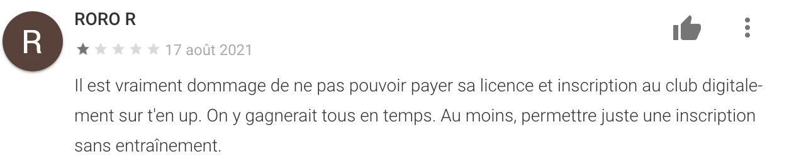
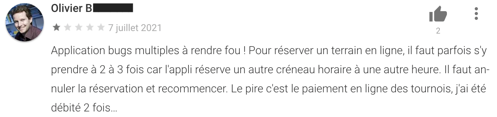

# Etude cas : TEN'UP - Fédération Française de Tennis

## Introduction

Ten’Up, c’est l'application mobile gratuite pour organiser facilement sa pratique du tennis au quotidien. Elle est accessible à tous les pratiquants en France, licenciés ou non.

**Mon rôle dans ce projet** : UX/UI Designer 

**Durée du projet** : 3 mois

**Méthodes de travail** : Questionnaires, Interviews, User journey map, Card sorting, Carte d'affinité, Wireframes, Prototypes

**Outils** :  Adobe XD, Figma, Sketch, Balsamiq, Optimal Sort, Flutter

## Contexte du projet

La Fédération Française de Tennis souhaite améliorer la note de son application TEN'UP sur les stores Android et Apple. Au début du projet, la note globale attribuée à l'appli est 3,4 sur 5. La FFT a pour cible de gagner 1 point supplémentaire sur la note globale. Pour se faire, elle oriente son projet vers une refonte UX/UI basée sur des recherches utilisateurs approfondies.

## Objectifs du projet

* Identifier les points de frictions durant le parcours utilisateur
* Redesigner le parcours utilisateur en transformant les frictions en opportunités
* Refondre le design system et l'UI de l'application mobile Android & iOS
* Proposer des prototypes fonctionnels

# Déroulement du projet

## **L'exploration**
Comprendre les besoins et les usages des utilisateurs.

__Objectif__ : Recueillir du verbatim afin de déceler des opportunités intéressantes et identifier des profils types d'utilisateurs appelés “personas”.

### Identification des frictions via le relevé des avis utilisateurs sur les stores d'applications

Frictions détectées au sujet de la fonctionnalité **"simulation de classement"**.

___

Frictions détectées sur la fonctionnalité de réservation en ligne

___

Frictions détectées sur la fonctionnalité de paiement de la licence et des tournois

---

J'ai ensuite directement contacté l'utilisateur qui avait laissé un avis plus complet, qui reprennait l'ensemble des éléments précédemment identifés : 

---

Il m'a accordé un entretien téléphonique rapide dont voici la retranscription synthétique.

> "
> 
> _L'application TEN'UP telle qu'elle est proposée aujourd'hui est difficilement utilisable par les licenciés. Il faut d'abord ouvrir un compte en ligne puis le valider en accédant à sa boite mail. Alors que la FFT pourrait très bien nous reconnaitre grâce à notre numéro unique de licencié._
>
> _L'application est lente, elle met environ 30 secondes à s'allumer au démarrage, puis l'enchainement des écrans laisse toujours apparaitre une balle de tennis en guise d'attente de l'écran suivant.
Les couleurs sont agressives, notamment lors d'utilisation dans un environnement peu éclairé (le matin dans la voiture avant les championnats, ou le soir après l'entraînement)._
>
> _Le système de simulation du classement future est opaque. En plus de ça la simulation ne donne pas le même résultat une fois sur deux. Le choix des options lors de l'ajout des matchs n'est pas très visible et les libellés ne sont pas très explicites._
>
> _En ce qui concerne le module de réservation des courts, l'affichage des crénéaux horaires laisse place au doute. Dans mon club on peut réserver à la demi-heure, or l'application bloque des créneaux complets d'1h._
>
> _Enfin, le système de paiement ouvre une page internet en dehors de l'application, page qui n'est pas aux couleurs ni de l'application TEN'UP, ni de la FFT (Fédération Française de Tennis). Ça de donne pas envie d'y saisir ses informations bancaires.
En plus la dernière fois, j'ai été prélevé deux fois lors de l'inscription au tournoi interne de mon club._
>
> _Bref, cette application qui devait simplifier la vie du licencié, peine à convaincre. Je continue d'appeler au téléphone les organisateurs de tournois lors de mes inscriptions._
> 
> "

A la suite de ces recherches j'ai pu établir plusieurs profils utilisateurs.

### Le tableau des Personnas

#### __Le compétiteur__

#### Gildas HAVARD

> _Commencer une compétition et ne pas vouloir la gagner, c'est être un compétiteur malhonnête._

**Age:** 30  
**Location:** Carquefou  
**Statut marital:** Fiancé  
**Enfant(s):** Non  
**Poste:** Directeur commercial  
**Niveau d'études:** Bac +5 
**Appareil préféré:** Mobile

#### CARACTÉRISTIQUES
* Observateur
* Combatif
* Enthousiaste

#### BESOINS

* Calculer mon prochain classement mensuel.
* Connaitre la programmation des tournois et compétitions autour de chez moi.
* Analyser mes statistiques de matchs.

#### APPÉTENCE TECHNIQUE & MULTIMEDIA
Expert

#### À PROPOS

Gildas possède l'application TEN'UP depuis sa sortie sur smartphone.
Il l'utilise principalement pour consulter les tournois autour de chez lui et pour simuler son prochain classement après chaque match qu'il dispute.

Il regrette que la simulation de classement soit compliquée et chronophage à cause de successions d'écrans mal pensés.
Il en est rendu à utiliser une feuille excel sur son ordinateur qu'il a réalisé lui-même.

Gildas donne la not de 3.5/5 à l'application.

## **L'idéation**
Grâce à la collecte des informations utilisateurs durant la phase d’exploration, il s’agit maintenant de produire des idées, émettre des hypothèses et trouver des solutions pour concrétiser les opportunités.

J'utilise pour cela la méthode du card sorting.
Avec la maîtrise d'ouvrage, je dispose les idées que j'ai identifiées sur des post-it. Un post-it = une idée.

Je demande ensuite aux participants de regrouper les pots-it selon par thématique.

Ci-dessous le tableau que j'ai obtenu.

| Classement  | Réservation  | Paiement  | UI  | 
|---|---|---|---|
| Classement instantanée  | Réservation court facile  |  Sécurisé | Mode sombre |
| Statistiques claires | Inscription tournoi | Intégré  | Pop-up intrusive  |

La cible est très claire, 4 grands axes de travail, classés par ordre de priorité de gauche à droite, et de haut en bas.

## **La conception**
Aussi appelée phase de génération, le but de cette étape est de produire des représentations physiques (wireframes, maquettes, prototypes…) des solutions envisageables.

La wireframes est le schéma fonctionnel basse-fidélité de l'application.
- Il facilite ainsi le travail d’équipe.
- Il aide à estimer le temps à passer et donc à chiffrer le coût.  Elle permet aussi une maîtrise des ressources (temps et argent).
Le troisième avantage est de donner vie à vos idées. Car une fois formalisées, vos idées seront concrètes, tangibles. En effet, couchées sur papier, ou à l’aide d’un logiciel, elles seront plus facilement exploitables : et par vous, et par les différentes équipes impliquées dans ce projet.

## **L'évaluation**
Les solutions produites vont pouvoir êtres testées auprès des utilisateurs et ainsi être validées ou non : c’est ce qu’on appelle les tests utilisateurs. Cette étape permet aussi de récolter des feedbacks afin d’améliorer les travaux réalisés.

Ce processus systémique peut être adapté selon les besoins du client.

Les phases de recherche, de compréhension et de récolte des besoins utilisateurs occupe une place importante. Il va y avoir également un travail très important au niveau de l’ergonomie, de l’évaluation et de la validation des hypothèses émises lors de l’étape d’idéation par le biais de différents moyens (SUS, tests utilisateurs, attrakdiff…)

C’est en cela que l’UX Research et l’UX Design sont étroitement liés : l’UX Research va se concentrer sur les tests utilisateurs tandis que l’UX Designer va pouvoir animer les ateliers, donc endosser le rôle de facilitateur, mais aussi matérialiser les hypothèses d’un point de vue ergonomique grâce aux wireframes.